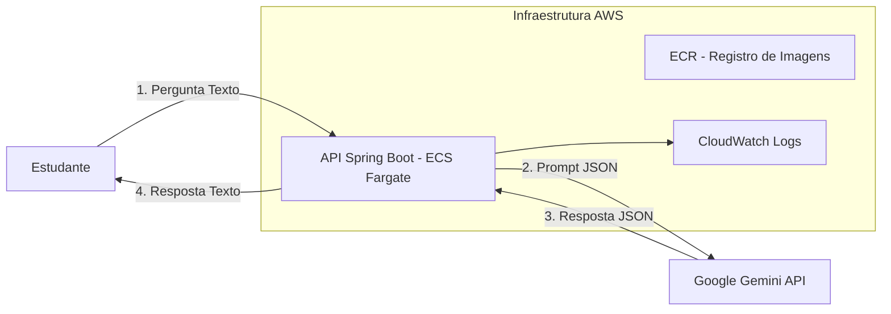
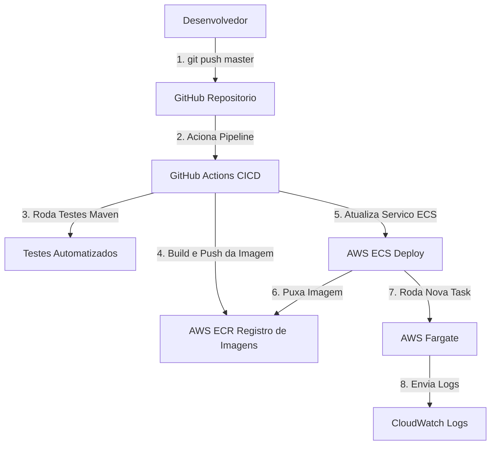

***

# IsCoolGPT: Assistente de Estudos em Cloud

**Autor:** Victor  
**Projeto:** Projeto Final Cloud 25.2

***

## 1. Visão Geral

O **IsCoolGPT** é um assistente educacional inteligente focado em Cloud Computing, DevOps e desenvolvimento de software.  
A solução foi implementada como uma API RESTful, utilizando uma arquitetura serverless moderna na AWS, com pipeline de integração e entrega contínua (CI/CD) totalmente automatizado.

- A API se conecta ao Google Gemini para gerar respostas, aplicando guardrails (via system prompt) e temperatura controlada (0.2) para garantir respostas precisas e focadas no tópico de estudos.

***

## 2. Diagrama de Arquitetura do Sistema

**Fluxo do Usuário (Aplicação):**




**Fluxo de DevOps (CI/CD):**



***

## 3. Stack de Tecnologias e Decisões

| Componente          | Tecnologia Escolhida         | Justificativa                                                                                                         |
|---------------------|-----------------------------|----------------------------------------------------------------------------------------------------------------------|
| Backend (API)       | Java 21 + Spring Boot       | Framework robusto e maduro para APIs RESTful, focando em desafios de Cloud e DevOps.                                 |
| LLM (IA)            | Google Gemini API           | API flexível, performática e de baixo custo, com autenticação via API Key.                                           |
| Containerização     | Docker                      | Portabilidade e consistência do ambiente da aplicação.                                                               |
| Otimização          | Multi-stage Builds          | Dockerfile em dois estágios para criar uma imagem leve, segura e rápida.                                             |
| CI/CD               | GitHub Actions              | Pipeline automatizado de build, teste e deploy a cada push na branch master.                                         |
| Registro de Imagem  | AWS ECR                     | Serviço gerenciado e seguro, integrado ao ECS.                                                                      |
| Orquestração        | AWS ECS + Fargate           | Orquestração serverless sem precisar gerenciar servidores.                                                           |
| Segurança           | IAM (Policies e Roles)      | Princípio do Menor Privilégio: 1) Usuário IAM para o GitHub Actions (ECR/ECS) 2) Role IAM para o ECS (ECR/CloudWatch)|
| Monitoramento       | AWS CloudWatch Logs         | Logs da aplicação enviados direto do Fargate para o CloudWatch.                                                      |
| Documentação        | Swagger/OpenAPI             | Interface interativa e auto-documentada (/swagger-ui.html).                                                          |
| Health Check        | Spring Boot Actuator        | Endpoint /actuator/health para monitoramento do ECS.                                                                 |

***

## 4. Como Executar Localmente (Docker)

**Pré-requisitos:**  
- Ter o Docker instalado  
- Possuir uma chave de API do Google Gemini

### 4.1 Construir a Imagem Docker

No diretório raiz do projeto:

```bash
docker build -t iscoolgpt:local .
```

### 4.2 Executar o Contêiner

Execute o contêiner, mapeando a porta 8080 e injetando a key:

```bash
# Substitua "SUA_CHAVE_GEMINI_AQUI" pela sua chave real
docker run -p 8080:8080 -e LLM_API_KEY="SUA_CHAVE_GEMINI_AQUI" iscoolgpt:local
```

***

## 5. Como Usar a API (Endpoints)

### Endpoint principal

- **POST /api/v1/iscool/ask**

Aceita uma String (texto puro) no body e retorna a resposta do assistente como texto.

**Exemplo de chamada cURL:**

```bash
curl -X POST http://localhost:8080/api/v1/iscool/ask \
     -H "Content-Type: text/plain" \
     -d "O que é AWS Fargate e por que ele é usado no ECS?"
```

### Endpoints adicionais

- **Health Check:**  
  GET `/actuator/health`

- **Documentação da API:**  
  GET `/swagger-ui.html`
  -----

***
